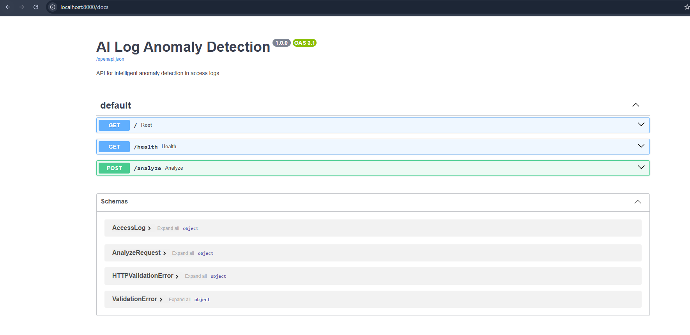
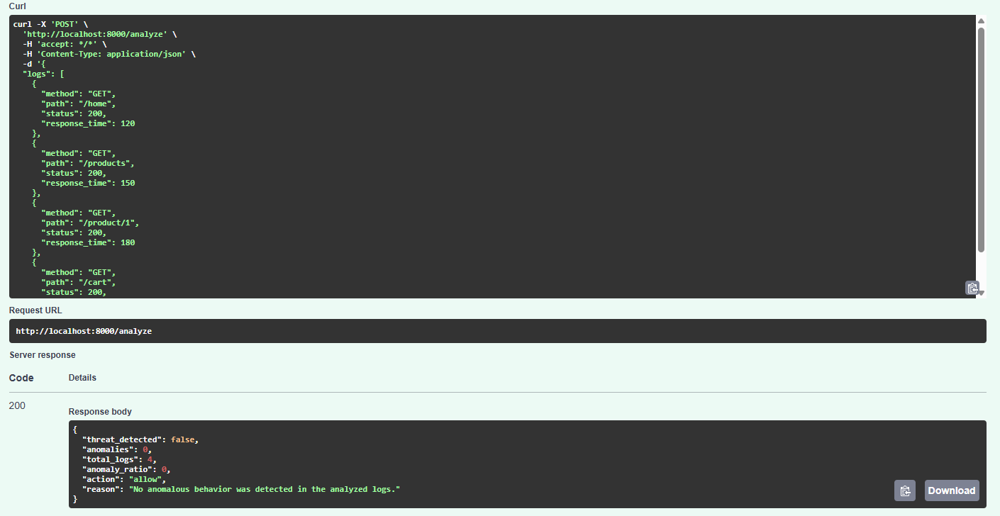
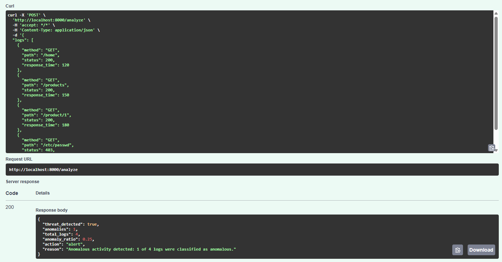
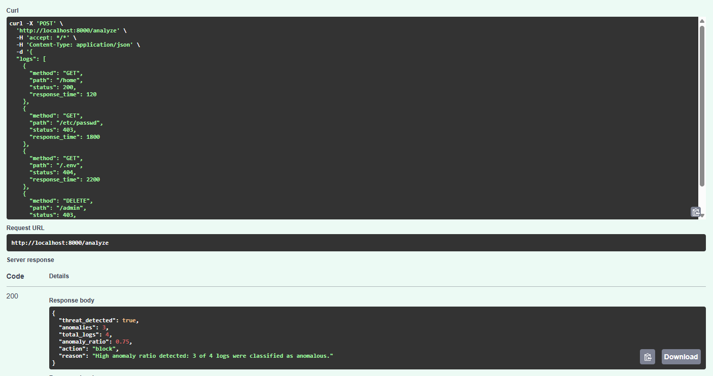
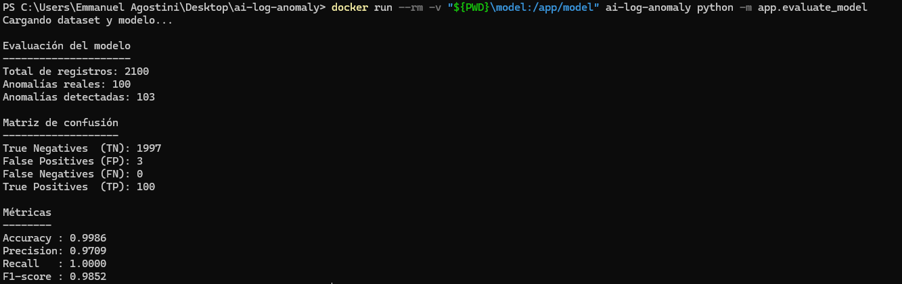
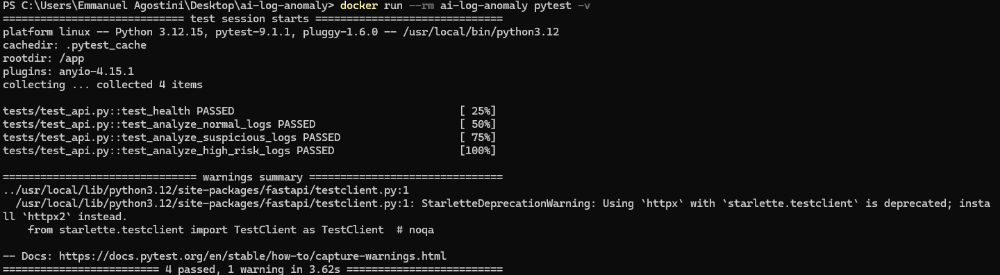

# AI Log Anomaly Detection

Prototipo de detección inteligente de anomalías en logs de acceso web desarrollado en Python.

La solución utiliza un modelo de Machine Learning basado en **Isolation Forest**, junto con dos agentes responsables del procesamiento de los logs y de la toma de decisiones.

El sistema expone una API REST desarrollada con **FastAPI**, capaz de recibir un lote de registros, analizarlos y devolver si se detectó actividad anómala junto con una acción sugerida: `allow`, `alert` o `block`.

---

## 1. Objetivo

El objetivo del proyecto es implementar un pipeline simple de detección de anomalías sobre registros de acceso web.

El flujo general es:

1. Recibir un lote de logs mediante la API REST.
2. Validar y normalizar los registros.
3. Preparar las características necesarias para el modelo.
4. Analizar los registros mediante un modelo Isolation Forest previamente entrenado.
5. Interpretar las predicciones obtenidas.
6. Determinar si existe una posible amenaza.
7. Sugerir una acción: permitir, generar una alerta o bloquear.

> La acción devuelta por el sistema es una recomendación. Este prototipo no realiza modificaciones reales sobre firewalls, WAF u otros controles de seguridad.

---

## 2. Arquitectura

La aplicación está compuesta por los siguientes elementos:


                    ┌──────────────────────┐
                    │       Cliente        │
                    │   POST /analyze      │
                    └──────────┬───────────┘
                               │
                               ▼
                    ┌──────────────────────┐
                    │       FastAPI        │
                    │ Validación Pydantic  │
                    └──────────┬───────────┘
                               │
                               ▼
                 ┌────────────────────────────┐
                 │    Log Ingestion Agent     │
                 │                            │
                 │ - Validación               │
                 │ - Normalización            │
                 │ - Preparación de registros │
                 └─────────────┬──────────────┘
                               │
                               ▼
                 ┌────────────────────────────┐
                 │     Isolation Forest       │
                 │                            │
                 │ Detección de anomalías     │
                 └─────────────┬──────────────┘
                               │
                               ▼
                 ┌────────────────────────────┐
                 │      Decision Agent        │
                 │                            │
                 │ - Interpreta predicciones  │
                 │ - Calcula anomaly ratio    │
                 │ - Sugiere una acción       │
                 └─────────────┬──────────────┘
                               │
                               ▼
                 ┌────────────────────────────┐
                 │       Respuesta API        │
                 │                            │
                 │ threat_detected            │
                 │ anomalies                  │
                 │ anomaly_ratio              │
                 │ action                     │
                 │ reason                     │
                 └────────────────────────────┘

---

## 3. Agentes

### Log Ingestion Agent

El `LogIngestionAgent` es responsable de recibir los registros provenientes de la API y prepararlos antes de enviarlos al modelo.

Sus responsabilidades principales son:

- Verificar que el lote no esté vacío.
- Validar la presencia de los campos requeridos.
- Normalizar métodos HTTP.
- Convertir los valores a los tipos esperados.
- Validar códigos de estado HTTP.
- Validar tiempos de respuesta.
- Validar el formato básico del path.
- Transformar los registros en un DataFrame de Pandas.

Los campos utilizados son:

- method
- path
- status
- response_time

### Decision Agent

El `DecisionAgent` recibe las predicciones generadas por el modelo y determina una acción sugerida según la proporción de anomalías encontrada.

La política implementada es:

| Proporción de anomalías  | Acción  |
|           ---            |  ---    |
|           0%             | `allow` |
| Mayor a 0% y menor a 50% | `alert` |
| 50% o superior           | `block` |

Además, devuelve una explicación (`reason`) indicando el motivo de la decisión.

---

## 4. Dataset

Para este prototipo se utilizó un **dataset sintético de logs de acceso web**.

El dataset contiene un total de: 10.500 registros

Distribuidos en: 10.000 registros normales y 500 registros anómalos

Cada registro contiene:

-timestamp
-ip
-method
-path
-status
-response_time
-label


El campo `label` indica:

0 = normal
1 = anomalía

Los registros normales simulan tráfico habitual hacia recursos como:

/
/home
/products
/product/1
/product/2
/login
/cart
/checkout
/contact

Los registros anómalos incluyen comportamientos artificialmente sospechosos, por ejemplo accesos a:

/admin
/wp-admin
/etc/passwd
/.env
/config.php


También presentan combinaciones de códigos HTTP de error y tiempos de respuesta superiores a los generados para el tráfico normal.

### Uso del label

El campo `label` **no se utiliza como feature del modelo Isolation Forest**.

Se utiliza para:

- mantener la proporción de registros normales/anómalos durante la separación de entrenamiento y evaluación mediante `stratify`;
- comparar posteriormente las predicciones del modelo contra los valores esperados;
- calcular métricas de evaluación.

Por lo tanto, el modelo no recibe el `label` como respuesta durante la inferencia.

---

## 5. Modelo de detección

Se utilizó:

**Isolation Forest - scikit-learn**

Isolation Forest es un algoritmo de detección de anomalías que permite identificar observaciones que presentan características diferentes al comportamiento predominante del conjunto de datos.

Para este prototipo se configuró:

python
IsolationForest(
    contamination=0.05,
    random_state=42
)

contamination=0.05 establece una proporción esperada de anomalías del 5%, valor cercano al 4,76% presente en el dataset sintético. Este parámetro interviene en la definición del umbral utilizado por Isolation Forest para clasificar observaciones como normales o anómalas. random_state=42 fija la semilla utilizada por los procesos aleatorios del algoritmo, permitiendo reproducir los resultados bajo las mismas condiciones. El valor 42 no tiene un significado técnico particular; se utiliza simplemente como una semilla fija.

### Features

El modelo utiliza las siguientes características:

-method
-path
-status
-response_time
-is_error
-is_sensitive_path


Las variables:

is_error
is_sensitive_path

son generadas durante la preparación de las features.

Las variables categóricas `method` y `path` son procesadas mediante `OneHotEncoder`:

python
OneHotEncoder(handle_unknown="ignore")

Esto permite que la aplicación procese categorías no presentes durante el entrenamiento sin producir un error por una categoría desconocida.

---

## 6. Entrenamiento previo e inferencia

El entrenamiento y la ejecución de la API se encuentran separados.

El modelo se entrena previamente y posteriormente se persiste utilizando `joblib`:

model/anomaly_model.pkl

Cuando se inicia la API, el modelo ya entrenado es cargado desde este archivo.

Por lo tanto, una solicitud a `/analyze` **no vuelve a entrenar el modelo**. La API utiliza el modelo persistido únicamente para realizar inferencia sobre los registros recibidos.

Esta implementación interpreta el requisito de modelo preentrenado como la utilización de un modelo entrenado y persistido previamente a la ejecución de la API.

---

## 7. Separación entrenamiento/evaluación

Para realizar una evaluación sobre registros que no participaron del entrenamiento, el dataset se divide utilizando:

80% entrenamiento
20% evaluación

Sobre los 10.500 registros:

Entrenamiento: 8.400 registros
Evaluación:    2.100 registros


La distribución de anomalías fue:

Entrenamiento: 400 anomalías
Evaluación:    100 anomalías

Se utilizó `random_state=42` para mantener reproducibilidad y `stratify` sobre el label para conservar la proporción de registros normales y anómalos.

Los 2.100 registros de evaluación no participan del entrenamiento del modelo.

---

## 8. Resultados de evaluación

El modelo fue evaluado sobre los **2.100 registros del conjunto holdout**, no utilizados durante el entrenamiento.

Resultados obtenidos:

Total de registros: 2100
Anomalías reales: 100
Anomalías detectadas: 103

True Negatives  (TN): 1997
False Positives (FP): 3
False Negatives (FN): 0
True Positives  (TP): 100

Métricas:

| Métrica   | Resultado |
|---        |---        |
| Accuracy  | 99,86%    |
| Precision | 97,09%    |
| Recall    | 100,00%   |
| F1-score  | 98,52%    |

En este conjunto de evaluación, el modelo detectó las 100 anomalías existentes y generó 3 falsos positivos.

### Experimento adicional 20/80

Adicionalmente se realizó una prueba invirtiendo la proporción:

20% entrenamiento
80% evaluación

Esto permitió observar el comportamiento del modelo cuando dispone de una cantidad considerablemente menor de registros para entrenamiento.

Resultados:

Entrenamiento: 2.100 registros
Evaluación:    8.400 registros

Anomalías reales en evaluación: 400
Anomalías detectadas: 438

True Negatives  (TN): 7962
False Positives (FP): 38
False Negatives (FN): 0
True Positives  (TP): 400

Métricas:

| Métrica           | 80% Train / 20% Test | 20% Train / 80% Test |
|---                |---                   |---                   |
| Accuracy          | 99,86%               | 99,55%               |
| Precision         | 97,09%               | 91,32%               |
| Recall            | 100,00%              | 100,00%              |
| F1-score          | 98,52%               | 95,47%               |
| Falsos positivos  | 3                    | 38                   |
| Falsos negativos  | 0                    | 0                    |

El experimento mostró que, dentro de este dataset sintético, al reducir considerablemente el conjunto de entrenamiento se mantuvo la detección de las anomalías del conjunto de prueba, pero aumentó la cantidad de falsos positivos.

La configuración principal del proyecto utiliza la separación **80% entrenamiento / 20% evaluación**.

---

## 9. API REST

La aplicación utiliza FastAPI.

Una vez iniciada se encuentra disponible en:

http://localhost:8000

La documentación Swagger se encuentra en:

http://localhost:8000/docs


### Health check

GET /health


Respuesta:

{
  "status": "ok"
}

### Análisis de logs

POST /analyze

Ejemplo de request:

{
  "logs": [
    {
      "method": "GET",
      "path": "/home",
      "status": 200,
      "response_time": 120
    },
    {
      "method": "GET",
      "path": "/products",
      "status": 200,
      "response_time": 150
    },
    {
      "method": "GET",
      "path": "/etc/passwd",
      "status": 403,
      "response_time": 1800
    }
  ]
}

La respuesta incluye:

threat_detected
anomalies
total_logs
anomaly_ratio
action
reason

---

## 10. Ejemplos de decisiones

### Tráfico normal

Para un lote donde el modelo no identifica anomalías:

{
  "threat_detected": false,
  "anomalies": 0,
  "total_logs": 4,
  "anomaly_ratio": 0.0,
  "action": "allow",
  "reason": "No anomalous behavior was detected in the analyzed logs."
}


### Actividad parcialmente anómala

Si se detectan anomalías pero representan menos del 50% del lote:

{
  "threat_detected": true,
  "anomalies": 1,
  "total_logs": 4,
  "anomaly_ratio": 0.25,
  "action": "alert",
  "reason": "Anomalous activity detected: 1 of 4 logs were classified as anomalous."
}

### Actividad altamente anómala

Ejemplo obtenido durante las pruebas:

{
  "threat_detected": true,
  "anomalies": 4,
  "total_logs": 4,
  "anomaly_ratio": 1.0,
  "action": "block",
  "reason": "High anomaly ratio detected: 4 of 4 logs were classified as anomalous."
}

## 11. Ejecución con Docker

### Requisitos

- Docker Desktop
- Git, en caso de clonar el repositorio

No es necesario instalar manualmente las dependencias de Python si se utiliza Docker.

### Construir la imagen

Desde la raíz del proyecto:

docker build -t ai-log-anomaly .

### Ejecutar la API

docker run --rm -p 8000:8000 ai-log-anomaly


Luego acceder a:

http://localhost:8000/docs

para utilizar Swagger UI.

## 12. Entrenamiento del modelo

El repositorio incluye un modelo previamente generado en:

model/anomaly_model.pkl

Si se desea volver a generar el dataset y entrenar nuevamente el modelo:

### Generar dataset

docker run --rm -v "${PWD}/data:/app/data" ai-log-anomaly python -m app.generate_dataset

### Entrenar

En PowerShell:

docker run --rm -v "${PWD}\model:/app/model" ai-log-anomaly python -m app.train_model

El proceso genera:

model/anomaly_model.pkl
model/test_data.csv

### Evaluar

docker run --rm -v "${PWD}\model:/app/model" ai-log-anomaly python -m app.evaluate_model

## 13. Tests

Se implementaron tests automatizados para validar los principales comportamientos de la API.

Los escenarios cubiertos incluyen:

- health check;
- lote de tráfico normal;
- lote con actividad anómala que genera `alert`;
- lote con alta proporción de anomalías que genera `block`.

Ejecutar:

docker run --rm ai-log-anomaly pytest -v

Resultado obtenido:

4 passed

Actualmente puede mostrarse una advertencia de deprecación asociada a la integración entre `Starlette TestClient` y `httpx`. La advertencia no impide la ejecución de los tests.


## 14. Estructura del proyecto

## 14. Estructura del proyecto

```text
ai-log-anomaly/
├── .gitignore
├── Dockerfile
├── README.md
├── requirements.txt
│
├── app/
│   ├── __init__.py
│   ├── anomaly_model.py
│   ├── evaluate_model.py
│   ├── generate_dataset.py
│   ├── main.py
│   ├── train_model.py
│   │
│   └── agents/
│       ├── __init__.py
│       ├── decision_agent.py
│       └── ingestion_agent.py
│
├── data/
│   └── access_logs.csv
│
├── docs/
│   └── images/
│       ├── 01-swagger-api.png
│       ├── 02-analyze-allow.png
│       ├── 03-analyze-alert.png
│       ├── 04-analyze-block.png
│       ├── 05-model-evaluation.png
│       └── 06-pytest.png
│
├── model/
│   ├── anomaly_model.pkl
│   └── test_data.csv
│
└── tests/
    └── test_api.py
```

## 15. Tecnologías utilizadas

- Python 3.12
- FastAPI
- Uvicorn
- Pandas
- scikit-learn
- Isolation Forest
- OneHotEncoder
- joblib
- Pydantic
- pytest
- Docker

## 16. Decisiones de diseño

### Dataset sintético

Se eligió generar un dataset sintético para disponer de un conjunto controlado de tráfico normal y anómalo y poder validar de forma reproducible el pipeline completo.

### Isolation Forest

Se seleccionó Isolation Forest por tratarse de un algoritmo orientado a detección de anomalías que no requiere utilizar las etiquetas como objetivo supervisado durante el entrenamiento.

### Separación entre entrenamiento e inferencia

El entrenamiento se realiza de forma independiente de la API.

La API únicamente carga el artefacto previamente generado y realiza inferencia, evitando reentrenamientos durante las solicitudes.

### Dos agentes

La lógica fue separada en dos responsabilidades:

Log Ingestion Agent
        ↓
Isolation Forest
        ↓
Decision Agent

Esto permite desacoplar la preparación de datos de la política utilizada para responder ante las anomalías.

## 17. Limitaciones

Este proyecto es un **prototipo técnico** y no debe interpretarse como un sistema de detección de amenazas listo para producción.

Las principales limitaciones son:

- El dataset utilizado es sintético.
- Los patrones anómalos fueron generados artificialmente y presentan diferencias claras respecto del tráfico normal.
- Las métricas obtenidas corresponden exclusivamente a este dataset y **no representan una tasa esperada de detección sobre tráfico real**.
- El modelo analiza cada registro a partir de las features definidas y no incorpora contexto histórico avanzado entre múltiples solicitudes.
- La política `allow / alert / block` utiliza umbrales definidos para demostrar el flujo del agente de decisión.
- `block` representa una acción sugerida; el prototipo no está integrado con un firewall o WAF para ejecutar el bloqueo.
- En un entorno productivo sería necesario entrenar y validar con tráfico real, analizar falsos positivos, monitorear model drift y revisar periódicamente los criterios de decisión.

## 18. Evidencias

### API REST - Swagger UI

La API expone los endpoints `/`, `/health` y `/analyze` mediante FastAPI.



### Análisis de tráfico normal - Allow

Ante un lote sin anomalías detectadas, el Decision Agent sugiere la acción `allow`.



### Detección parcial de anomalías - Alert

Cuando se detecta actividad anómala pero representa menos del 50% del lote, el Decision Agent sugiere `alert`.



### Alta proporción de anomalías - Block

Cuando al menos el 50% del lote es clasificado como anómalo, el Decision Agent sugiere `block`.



### Evaluación del modelo

Evaluación realizada sobre el conjunto holdout del 20%, compuesto por 2.100 registros que no participaron del entrenamiento.



### Tests automatizados

Los cuatro tests implementados para validar el funcionamiento de la API finalizaron correctamente.



---

## 19. Flujo completo

```text
Dataset
   │
   ▼
Generación / carga de logs
   │
   ▼
Train / Test Split
   │
   ├─────────────── 80% Train
   │                    │
   │                    ▼
   │             Isolation Forest
   │                    │
   │                    ▼
   │           anomaly_model.pkl
   │
   └─────────────── 20% Test
                        │
                        ▼
                    Evaluación


Ejecución de la API:

Cliente
   │
   ▼
POST /analyze
   │
   ▼
FastAPI / Pydantic
   │
   ▼
Log Ingestion Agent
   │
   ▼
Isolation Forest preentrenado
   │
   ▼
Predicciones
   │
   ▼
Decision Agent
   │
   ▼
allow / alert / block
```

---

## Conclusión

El proyecto implementa un pipeline completo y reproducible de detección de anomalías en logs, separando el procesamiento de datos, la inferencia del modelo y la toma de decisiones.

La solución permite recibir logs mediante una API REST, procesarlos mediante un agente de ingesta, analizarlos utilizando un modelo Isolation Forest previamente entrenado y utilizar un segundo agente para sugerir una respuesta según las anomalías detectadas.

La evaluación se realizó utilizando un conjunto holdout que no participó del entrenamiento, manteniendo separadas las etapas de entrenamiento, evaluación e inferencia.
